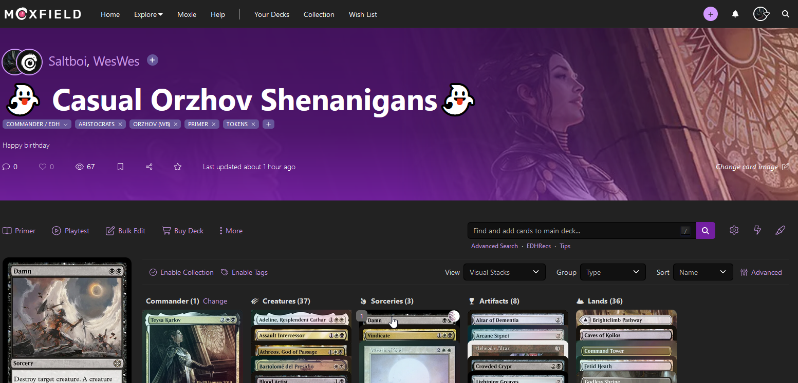
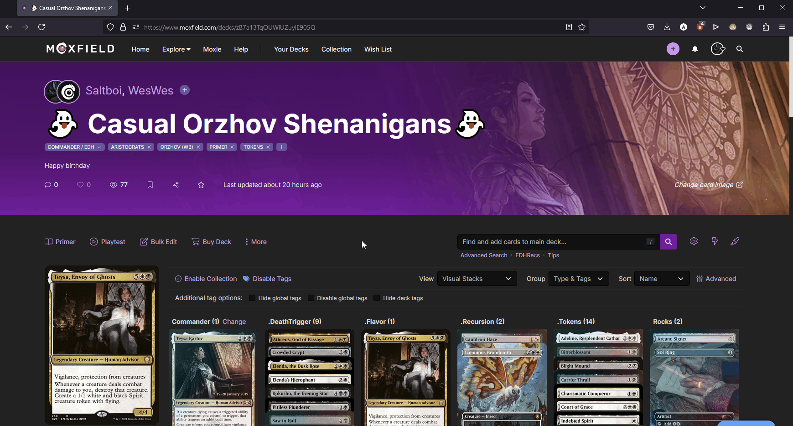

# Moxfield to Scryfall Linker

A simple Firefox extension that adds a Scryfall link icon when you hover over a card image in a Moxfield deck.

## Screenshot

## How It Works

This extension dynamically adds a Scryfall link button to card images on Moxfield deck pages. Clicking the scryfall icon will take you to scryfall. 

